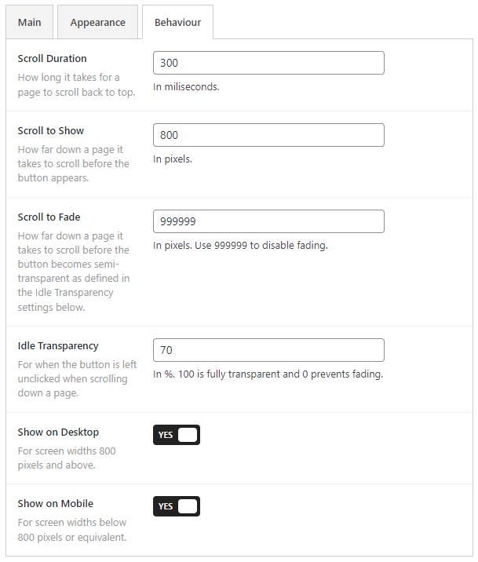

# Flexible Scroll Top

Contributors: qriouslad  
Donate link: https://paypal.me/qriouslad
Tags: scroll top, scroll to top, back to top, scroll up, no jquery  
Requires at least: 5.0  
Tested up to: 6.0.3  
Stable tag: 1.5.0  
License: GPLv2 or later  
License URI: http://www.gnu.org/licenses/gpl-2.0.html

Add a slick, lightweight and customizable scroll to top button that uses SVG icon with no jQuery dependency.

## Description

**Flexible Scroll Top** enables you to add a slick, lightweight and customizable scroll-to-top button that can be customized to match the design of your website. 

### Features

* Uses SVG icon which looks sharp at any size and screen resolution
* Easily understandable and visual options to customize the button's appearance
* Customize when and how the button appears or disappears with screen scrolling progression
* Can be shown/hidden on either/both desktop and mobile views
* Lightweight. Minimal CSS and JS on the frontend with no jQuery dependency.
* Great tandem with the [Floating Share Button](https://wordpress.org/plugins/floating-share-button/) plugin. Works beatifully on both desktop and mobile devices, especially if you are looking for a minimalist approach.

Please see the screenshots below for the range of customizations possible.

### Give Back

* [A nice review](https://wordpress.org/plugins/flexible-scroll-top/#reviews) would be great!
* [Give feedback](https://wordpress.org/support/plugin/flexible-scroll-top/) and help improve future versions.
* [Github repo](https://github.com/qriouslad/flexible-scroll-top) to contribute code.
* [Donate](https://paypal.me/qriouslad) and support my work.

## Screenshots

1. Main options for the button
   
2. Options to customize the appearance of the button
   
3. Options to change the behaviour of the button
   

## Installation

1. Login to your WordPress admin dashboard and go to "Plugins > Add New" page.
2. Search for "Flexible Scroll Top".
3. Click "Install" and then "Activate".
4. Go to "Settings > Flexible Scroll Top" and switch to YES on the "Enable?" option and click "Save".
5. Customize the appearance and behaviour as needed.

## Frequently Asked Questions

### How was this plugin built?

This plugin is built with the excellent [WordPress Plugin Boilerplate](https://github.com/devinvinson/WordPress-Plugin-Boilerplate/), [wppb.me](https://wppb.me/) generator, [CodeStar](https://github.com/Codestar/codestar-framework) admin options framework, [Back to Top](https://github.com/CodyHouse/back-to-top) pure javascript library and some nice [freeicons.io](https://freeicons.io/) icons from [icon king1](https://freeicons.io/profile/3), [Reda](https://freeicons.io/profile/6156), [wishforge.games](https://freeicons.io/profile/2257) and [Raj Dev](https://freeicons.io/profile/714).

## Changelog

### 1.5.0 (2022.10.26)

* [Added] Suppression of all admin notices to keep the plugin settings page clean
* [Changed] Properly inline CSS styles defined via plugin settings using wp_add_inline_style()
* [Changed] Properly output behaviour defined via plugin settings in the public js file via wp_localize_script()
* [Security] Output svg directly, i.e. not via a variable, for better security best practice compliance
* [Changed] Now uses a prefixed CodeStar Framework to prevent collision with other plugins loading the default, non-prefixed version
* [Changed] Improved links style in settings page header and footer

### 1.4.1 (2022.05.26)

* Tested to be compatible with WordPress 6.0
* Add review, feedback and donate links in settings page

### 1.4.0 (April 2022)

* Downgrade CodeStar framework with free, lighter version

### 1.3.2 (April 2022)

* Fix sizing issue with image select buttons due to css conflict 

### 1.3.0 (April 2022)

* Implement custom corner spacing option

### 1.2.1 (April 2022)

* Modify button z-index property so it stays on top

### 1.2.0 (March 2022)

* Add background hover color settings

### 1.1.0 (February 2022)

* Replace "Hide on Mobile" option with "Show on Desktop" and "Show on Mobile" options. This is for better control of how the button is shown or hidden on both screen sizes.

### 1.0.2 (February 2022)

* Update SVG icon definitions to work with Safari on iOS.

### 1.0.1 (February 2022)

* Capitalize "Hide on Mobile" field title.

### 1.0.0 (February 2022)

* Initial, stable release.